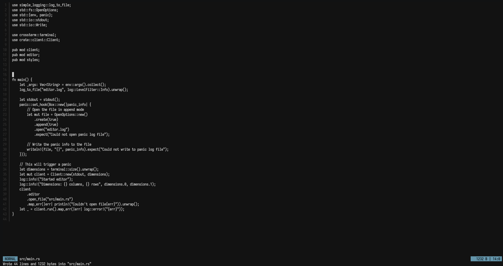

# Text editor in Rust

A text editor I'm making for fun that is really not like vim at all(it is). 

## Features
   - Edits text
   - Vim emulation for normal mode and stuff
   - Is fast

## TODO
   - [ ] Switch from Vec<String> to a performant data structure (Big refactor)
   - [ ] Syntax highlighting
   - [ ] File manager
   - [ ] Useful features

## Libraries used
 - [crossterm](https://crates.io/crates/crossterm)
 - [anyhow](https://crates.io/crates/anyhow)
 - [log](https://crates.io/crates/log)
 - [simple-logging](https://crates.io/crates/simple-logging)
